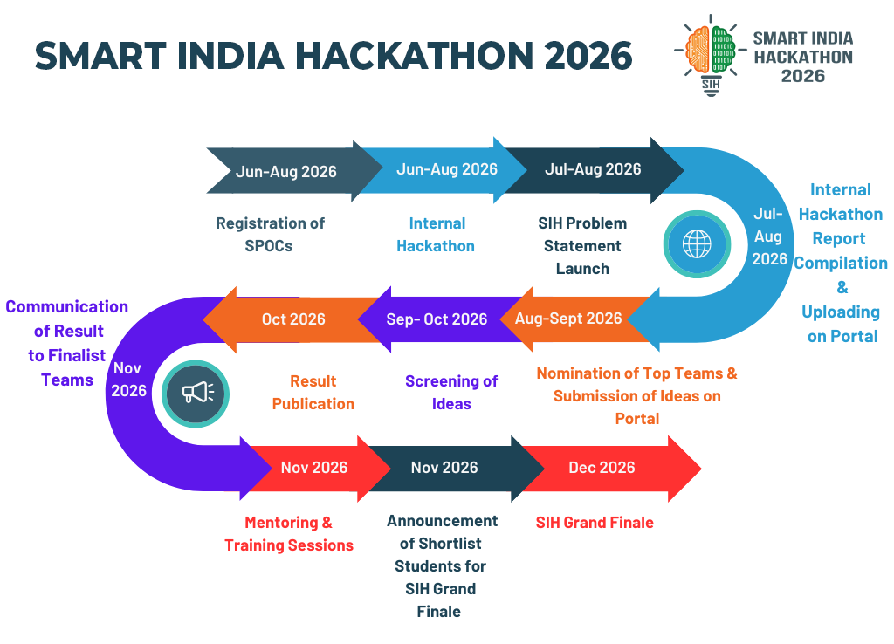
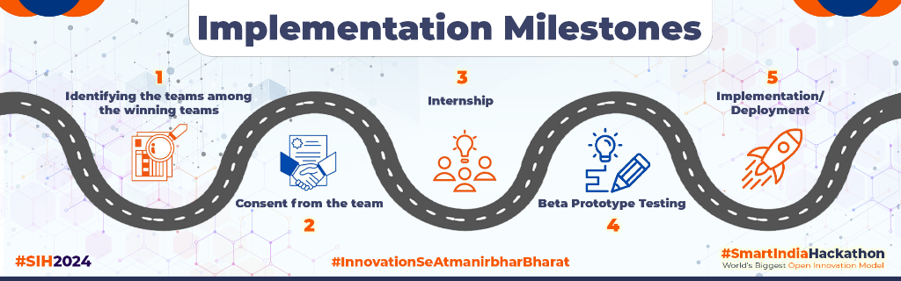
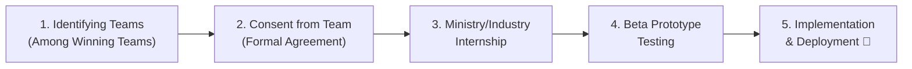

# 🚀 Smart India Hackathon (SIH) 2026 — Master Knowledge Base & Toolkit

[](https://www.sih.gov.in/)
[](https://www.sih.gov.in/sih2026PS)
[](https://www.sih.gov.in/projectImplementation)
[](#)
[](#)
[](#)
[](#)
[](#)

> Complete, structured knowledge base, research analysis, difficulty ratings, domain-specific guides, presentation pitch templates, post-hackathon implementation roadmaps, and decision frameworks for all **226 official Problem Statements** of **Smart India Hackathon 2026**.

---

## 🗺️ Official SIH 2026 Process Flow & Roadmap



---

## 🚀 Post-Hackathon Implementation Milestones





---

## 🌐 Official Portals & Direct Links

- 🏛️ **SIH Official Main Portal:** [https://www.sih.gov.in/](https://www.sih.gov.in/)
- 📋 **SIH 2026 Official Problem Statements Portal:** [https://www.sih.gov.in/sih2026PS](https://www.sih.gov.in/sih2026PS)
- 🚀 **SIH Project Implementation & Adoption Portal:** [https://www.sih.gov.in/projectImplementation](https://www.sih.gov.in/projectImplementation)

---

## 📁 Repository File Structure

```plaintext
/
├── README.md                                    ← Main Index & Navigation Hub (You are here)
├── sih_2026_process_flow.png                    ← Official Process Roadmap Infographic
├── sih_implementation_milestones.png            ← Official Implementation Milestones Infographic
├── SIH2026_About_SIH.md                         ← What is SIH, Benefits, Process & Timeline
├── SIH2026_All_226_Problem_Statements.md        ← Complete list of all 226 PS across 18 themes
├── SIH2026_Hardware_Problem_Statements.md       ← All 54 Hardware Problem Statements
├── SIH2026_Software_Problem_Statements.md       ← All 172 Software Problem Statements
├── SIH2026_Theme_And_Organization_Breakdown.md  ← PS distribution by 18 Themes & ~29 Ministries/Orgs
├── SIH2026_AI_ML_Problem_Statements.md          ← Curated ~92 AI/ML, Deep Learning, CV & NLP PS
├── SIH2026_Cybersecurity_Cloud_DataScience.md   ← Curated ~70 Cyber, Blockchain & Cloud/AI PS + Resources
├── SIH2026_Difficulty_Levels.md                 ← 🟢 Easy (~31), 🟡 Medium (~39), 🔴 Difficult (~33), ⚪ Open (34)
├── SIH2026_How_To_Pick_Your_PS.md               ← 6-Step Decision Framework & Filtering Checklist
├── SIH2026_Idea_Research_Prompt_Template.md     ← Reusable Deep-Dive Research Prompt Template
├── SIH2026_PPT_Submission_Template.md           ← Official 6-Slide Pitch Deck Content-Planning Guide
└── SIH2026_RESEARCH_AND_ANALYSIS.md             ← Competitive Analysis, Novelty, Feasibility & Tier Rankings
```

---

## 📚 Guide to Each Document

### 1. 🌟 [SIH2026_About_SIH.md](file:///d:/Sih/SIH2026_About_SIH.md)
Comprehensive introduction to Smart India Hackathon: official 11-step timeline roadmap, 5-step post-hackathon implementation milestones, 8 student benefits, career impacts, funding/incubation, and official facts.

### 2. 📑 [SIH2026_All_226_Problem_Statements.md](file:///d:/Sih/SIH2026_All_226_Problem_Statements.md)
The complete master catalog of all 226 problem statements released by various ministries, departments, and industry partners, categorized under the 18 official themes.

### 3. 🛠️ [SIH2026_Hardware_Problem_Statements.md](file:///d:/Sih/SIH2026_Hardware_Problem_Statements.md)
Dedicated catalog containing all **54 Hardware Problem Statements** across Disaster Management, Robotics/Drones, Space Tech, Agriculture IoT, Defense, and MedTech.

### 4. 💻 [SIH2026_Software_Problem_Statements.md](file:///d:/Sih/SIH2026_Software_Problem_Statements.md)
Dedicated catalog containing all **172 Software Problem Statements** spanning AI/ML, Web/Mobile, Cloud, Big Data, Blockchain, and Automation.

### 5. 🏛️ [SIH2026_Theme_And_Organization_Breakdown.md](file:///d:/Sih/SIH2026_Theme_And_Organization_Breakdown.md)
Detailed distribution breakdown across:
- **18 Themes** (Disaster Mgmt, Smart Automation, Space Tech, Cyber, Agriculture, etc.)
- **~29 Ministries & Organizations** (MoES 26 PS, NTRO 20 PS, MHA 13 PS, ISRO 11 PS, DRDO 9 PS, AICTE 34 PS, etc.)

### 6. 🤖 [SIH2026_AI_ML_Problem_Statements.md](file:///d:/Sih/SIH2026_AI_ML_Problem_Statements.md)
A curated guide of **~92 Problem Statements (~41% of SIH)** sub-categorized by AI techniques:
- **Predictive Analytics & Time-Series Forecasting**
- **Computer Vision & Video Analytics**
- **NLP, Conversational AI & RAG Chatbots**
- **Autonomous Systems, Edge-AI & AI Agents**

### 7. 🔐 [SIH2026_Cybersecurity_Cloud_DataScience.md](file:///d:/Sih/SIH2026_Cybersecurity_Cloud_DataScience.md)
A curated list of **~70 problem statements** focused on:
- **Cybersecurity, Digital Forensics & Cryptography** (NTRO, MHA, BEL, Egreen Quanta)
- **Cloud Computing, Big Data Platforms & AI/ML Analytics** (MoES, ISRO, Oil India, MoSPI)

### 8. 🎯 [SIH2026_Difficulty_Levels.md](file:///d:/Sih/SIH2026_Difficulty_Levels.md)
Categorization of problem statements into feasibility bands:
- 🟢 **Easy (~31 PS):** Standard tech stacks, public datasets, rapid 36–48 hr builds.
- 🟡 **Medium (~39 PS):** Solid ML models, time-series forecasting, multi-camera fusion & domain integrations.
- 🔴 **Difficult (~33 PS):** Specialized defense hardware, aerospace digital twins, RF/antenna design, deep cryptography.
- ⚪ **Student Innovation (34 PS):** AICTE flexible theme-based slots where students propose their own idea.

### 9. 🧭 [SIH2026_How_To_Pick_Your_PS.md](file:///d:/Sih/SIH2026_How_To_Pick_Your_PS.md)
A practical 6-step decision framework:
1. Team Skillset Audit
2. Preparation Timeline Strategy
3. Hardware Access & Budget Reality
4. Crowded vs Niche Space Selection
5. Real-World Data Availability Check
6. 5-Point Yes/No Filter Checklist

### 10. 📊 [SIH2026_PPT_Submission_Template.md](file:///d:/Sih/SIH2026_PPT_Submission_Template.md)
A complete **6-Slide Content-Planning Template** for your Internal Hackathon / Idea Submission deck:
- **Slide 1:** Title & Team Information
- **Slide 2:** Problem Statement & Gap Overview
- **Slide 3:** Proposed Solution & Flow Architecture
- **Slide 4:** Technical Feasibility & Tech Stack
- **Slide 5:** Social, Economic & Environmental Impact
- **Slide 6:** Research, References & Team Details

### 11. 📝 [SIH2026_Idea_Research_Prompt_Template.md](file:///d:/Sih/SIH2026_Idea_Research_Prompt_Template.md)
A ready-to-use research prompt template. Once your team selects a problem statement, fill in the blanks and run it to produce a comprehensive deep-dive report.

### 12. 🔬 [SIH2026_RESEARCH_AND_ANALYSIS.md](file:///d:/Sih/SIH2026_RESEARCH_AND_ANALYSIS.md)
Comprehensive research report assessing all 226 problem statements:
- **Novelty & Differentiation Assessment** (🟢 12% Potentially New, 🟡 42% Differentiation Opportunity, 🔴 30% Crowded, ⚪ 15% Open).
- **Competitor Evidence** (IMD Mausam, SVAMITVA, Plantix, Chainalysis, Google ARDA, Blancco, Onfido, etc.).
- **Scoring & Tier-wise Ranking (Tiers 1 to 6)** based on innovation, feasibility, social impact, and market potential.

---

## 📊 Summary Breakdown

| Metric | Count |
|---|---|
| **Total Problem Statements** | **226** |
| 💻 **Software Category** | **172** (76.1%) |
| 🛠️ **Hardware Category** | **54** (23.9%) |
| 🤖 **AI / ML-Centric PS** | **~92** (~41%) |
| 🏷️ **Total Themes** | **18 Themes** |
| 🏛️ **Total Organizations / Ministries** | **~29** |
| 🎓 **Student Innovation (AICTE)** | **34 slots** |
| 📅 **Idea Submission Deadline** | **20 September 2026** |
| 🏆 **Grand Finale** | **December 2026** |
| 🌐 **Official Main Portal** | [https://www.sih.gov.in/](https://www.sih.gov.in/) |
| 📋 **Official 2026 PS Portal** | [https://www.sih.gov.in/sih2026PS](https://www.sih.gov.in/sih2026PS) |
| 🚀 **Official Implementation Portal** | [https://www.sih.gov.in/projectImplementation](https://www.sih.gov.in/projectImplementation) |

---

## ⚠️ Disclaimer

> [!NOTE]
> This repository and its accompanying analysis, guides, research reports, difficulty classifications, and prompt templates are compiled independently by the student/developer community for academic, planning, and preparation purposes.
> 
> - **Official Authority:** Smart India Hackathon (SIH) is organized by the Ministry of Education's Innovation Cell (MIC) and AICTE.
> - **Source of Truth:** All official guidelines, problem descriptions, eligibility criteria, submission templates, deadlines, and evaluation rules are governed solely by the official SIH portal: **[https://www.sih.gov.in/](https://www.sih.gov.in/)**.
> - **Verification:** Participating teams are strongly advised to always cross-verify problem details, requirements, and submission guidelines directly on the official portal before submitting their proposals.

