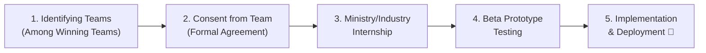

# What is SIH (Smart India Hackathon)?

**Smart India Hackathon (SIH)** is a nationwide initiative by the **Government of India**, organized by the **Ministry of Education's Innovation Cell (MIC)** in partnership with **AICTE (All India Council for Technical Education)**, to provide students a platform to solve pressing real-world problems faced by government ministries, departments, PSUs, and industry partners.

It's one of the **world's largest open innovation hackathons**, where student teams compete to build working solutions (software or hardware prototypes) for problem statements submitted by actual government bodies and companies — not hypothetical challenges.

---

## 🗺️ Official SIH 2026 Process Flow & Roadmap

---

## 🚀 Post-Hackathon Implementation Milestones

Winning SIH is not the end — the Government of India actively works to deploy winning prototypes into real-world use via the **SIH Project Implementation Framework**:

### 5-Step Adoption Lifecycle:
1. **Identifying the teams among the winning teams:** The ministry/organization reviews the finale results and selects projects suitable for actual deployment.
2. **Consent from the team:** Team members sign formal consent and agreements regarding IP, implementation timelines, and project scope.
3. **Internship:** Winning student developers are awarded paid/sponsored internships directly with the ministry, PSU, or partner organization to build the production system.
4. **Beta Prototype Testing:** Developing the production-ready beta version, conducting user acceptance testing (UAT), security audits, and field trials.
5. **Implementation / Deployment:** Full rollout across government infrastructure, state portals, or public deployment under the **#InnovationSeAtmanirbharBharat** initiative.

---

## 🧭 How It Works (Step-by-Step Breakdown)

1. **Registration of SPOCs (Jun–Aug 2026):** Colleges and universities designate Single Points of Contact (SPOCs) to coordinate and administer the internal selection.
2. **Internal Hackathon (Jun–Aug 2026):** Colleges conduct internal hackathons to filter and select their best student teams and ideas.
3. **Problem Statement Launch (Jul–Aug 2026):** Ministries, PSUs, and industry partners publish the official 226 problem statements.
4. **Report Compilation & Uploading (Jul–Aug 2026):** College SPOCs compile the internal hackathon reports, jury feedback, and upload documentation to the SIH portal.
5. **Nomination & Submission (Aug–Sept 2026):** Top shortlisted teams submit their detailed idea proposals on the portal (Deadline: 20 September 2026).
6. **Screening of Ideas (Sep–Oct 2026):** AICTE, ministry evaluators, and technical experts evaluate all nationwide submissions.
7. **Result Publication (Oct 2026):** Official shortlist of qualifying teams published.
8. **Communication to Finalist Teams (Nov 2026):** Official confirmation and nodal center allocations sent to finalist teams.
9. **Mentoring & Training Sessions (Nov 2026):** Finalist teams receive mentorship from ministry officials, scientists, and domain specialists.
10. **Grand Finale Shortlist Announcement (Nov 2026):** Final roll of competing teams confirmed.
11. **SIH Grand Finale (Dec 2026):** 36-hour non-stop national hackathon grand finale across multiple nodal centers across India.

---

## 🎯 What Benefits Do Students Get?

### 1. **Real-World Problem Solving Experience**
You work on problems that actually matter to ministries, PSUs, and industries — not toy projects. This is genuine exposure to how government/enterprise-scale problems are framed and solved.

### 2. **Cash Prizes & Recognition**
Winning and top-performing teams receive **cash prizes** (historically ₹1 Lakh per problem statement) plus certificates and public recognition from the Government of India.

### 3. **Direct Access to Government/Industry Mentors**
Teams get guidance from actual domain experts, scientists, and officials from organizations like ISRO, DRDO, NTRO, MoES, MHA, and more.

### 4. **Resume & Career Boost**
SIH participation (and especially winning) is a major resume differentiator — recruiters and grad schools recognize it as proof of real-world problem-solving, teamwork, and execution under pressure.

### 5. **Networking**
You connect with thousands of students, mentors, and industry professionals across India — many teams go on to build startups through connections made at SIH.

### 6. **Potential for Real Adoption / Incubation / Paid Internships**
Winning solutions receive **implementation support, ministry internships, and government deployment** via [https://www.sih.gov.in/projectImplementation](https://www.sih.gov.in/projectImplementation).

### 7. **Skill Development**
Rapid prototyping, high-pressure execution, team collaboration, technical pitching, and turning vague problems into concrete solutions.

### 8. **National-Level Certificate**
Every participating team gets an official certificate of participation from AICTE/Ministry of Education.

---

## 📌 Quick Facts (SIH 2026 Edition)

| Detail | Info |
|---|---|
| Organized by | Ministry of Education's Innovation Cell (MIC) + AICTE |
| Total Problem Statements (2026) | 226 (Hardware: 54, Software: 172) |
| Themes | 18 |
| Team size | Up to 6 students (+ mentor) |
| Format | College-level shortlisting → National Grand Finale (36-hr hackathon) |
| Idea Submission Deadline | 20 September 2026 |
| Grand Finale | December 2026 |
| Official Main Portal | [https://www.sih.gov.in/](https://www.sih.gov.in/) |
| Official 2026 PS Portal | [https://www.sih.gov.in/sih2026PS](https://www.sih.gov.in/sih2026PS) |
| Official Project Implementation Portal | [https://www.sih.gov.in/projectImplementation](https://www.sih.gov.in/projectImplementation) |

---

## 💡 Why You Should Participate

If you're a student wondering whether SIH is "worth it" — the honest answer: **yes, even if you don't win.** The experience of scoping a real problem, building something functional under a deadline, and pitching it to real evaluators is one of the highest-value things you can put on a resume as an engineering/tech student in India.

---

**Official Links & Portals:**
- 🏛️ **Main Portal:** [https://www.sih.gov.in/](https://www.sih.gov.in/)
- 📋 **2026 Problem Statements:** [https://www.sih.gov.in/sih2026PS](https://www.sih.gov.in/sih2026PS)
- 🚀 **Project Implementation:** [https://www.sih.gov.in/projectImplementation](https://www.sih.gov.in/projectImplementation)

**Disclaimer:** This is a general informational summary compiled independently to help students quickly understand SIH. For official rules, prize amounts, exact eligibility criteria, and registration details for SIH 2026, always refer to the official portal: **[https://www.sih.gov.in/](https://www.sih.gov.in/)**
